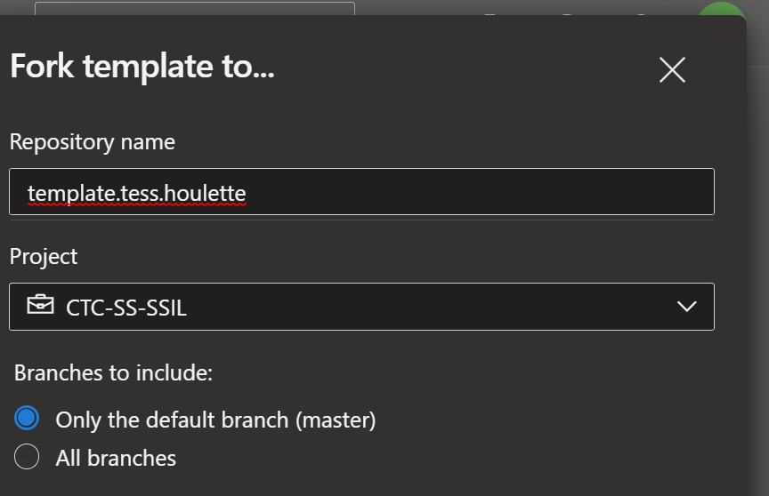
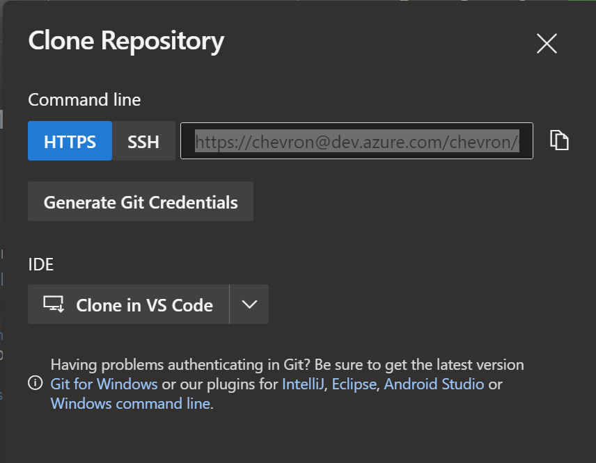
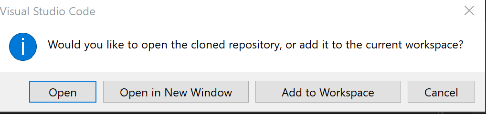
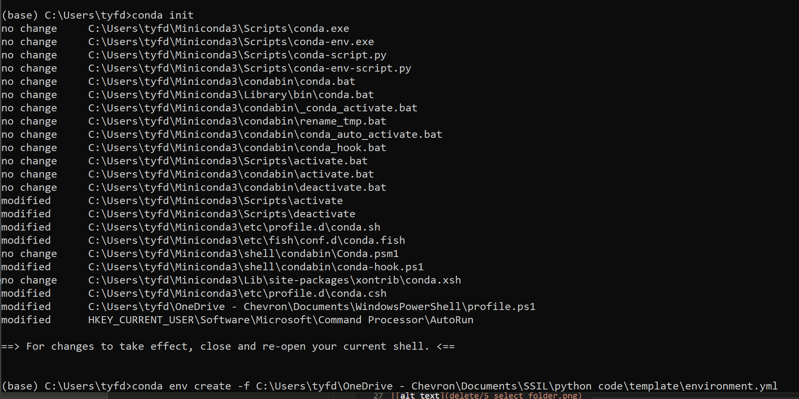

# Introduction 
TODO: template repo with folder structure set up (inputs, outputs, src code, yml environment setup & jupyter notebook)

# New 

# Prerequisites
1.	Ensure you have Miniconda: https://repo.anaconda.com/miniconda/Miniconda3-py39_4.11.0-Windows-x86_64.exe
2.  Ensure you have vscode: https://code.visualstudio.com/download
- you may need to install the Jupiter extension in VS code
- If it says you don’t have it set up – you will need to download git from (https://git-scm.com/) and follow the instructions. I just did all the defaults:Git (git-scm.com)

# Set up repo:

1. Next to the the name of the repo, 'template', click the more options then "fork":

   {:height="20%" width="50%"}
  
2. Enter name & continue

3. Next to the the name of the **new** repo, click the more options (see step 1) then "clone".

4. Click 'Clone in VS Code' under 'IDE':

5. Accept any security questions & select folder:

6. Select the right option for you:

7. Set up environment:
- open environment file and edit as needed, at the very least change the name of the environment.
- Open Anaconda Prompt from ‘Start’ -> ‘Anaconda3 (64 bit)’ -> ‘Anaconda Prompt’, enter “conda init”.
- enter the following after inputting the correct <'file_path'> you selected in step 5:	
	conda env create -f C:<'file_path'>\environment.yml

- once done type conda activate <' the environment name you selected'>

8. Set up jupyter notebook: kernel & imports

9.  Make changes, stage, commit & sync

# Contribute
TODO: feel free to contribute to make this better, but please don't overwrite the template!
